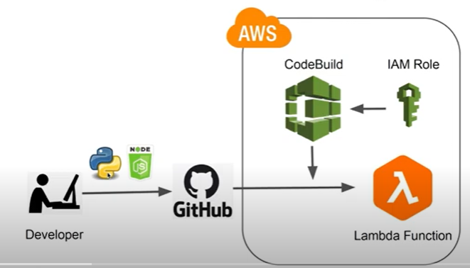

# TASK 2: BACKEND APPLICATION IMPLEMENTATION

This repo contains the deliverable for a backend solution exposing the requested metrics. It serves the output of the following computations:
- the average monthly value from 1st of June 2022 to 1st of July 2023 metrics for each ADM1 area of Colombia and Burkina Faso (metric A)
- The daily national estimate for the FCS prevalence from the 1st of June 2022 to the 1st of July 2023
(metric B) and its variance

## Used tech stack

I used an AWS lambda function for the backend implementation. The choice of using a serverless approach, instead of using a server and backend python API development using  e.g. Flask API, relies on choosing to leverage the Serverless computation as it is cost saving, and easily scalable.
The backend service is available at the following endpoint: https://byyp3wv7otj6cmoxmksgwz5bze0pocum.lambda-url.eu-central-1.on.aws/
The endpoint returns a JSON object of the requested metrics as follows:
---
{
    "COL": {
    "metric_a": [
        "average": {
            "2022-6": {"people": 790956.53,"prevalence": 0.12},
            ...
        }],
    }
    "metric_b": {
        "2022-06-01": {"people": 5712364,"prevalence": 0.11,"variance": 0.01}
        ...
    },
    "BFA": {
        "metric_a": [...],
        "metric_b": {...}
    }
}
---

### Deployment
The deployment of the code is automized and the used CI/CD approach is shown in the above figure

I used the AWS codeBuild service. Whenever we push the code to Github, an automatic build, and deployment will follow.
For more complete CI/CD with staging and testing, it can be extended to use the AWS Code pipeline service.

### Code
Here is a list of the main files and their usage 
- **lambda_function.py** contains all the necessary code used to compute and deliver the output of the requested metrics
- **iam-policy.json** contains the policy to add to the CodeBuild service
- **buildspec.yml** file will first install the dependencies for the Lambda function code. Then, it will zip up the Lambda function code and deploy it to AWS Lambda.

